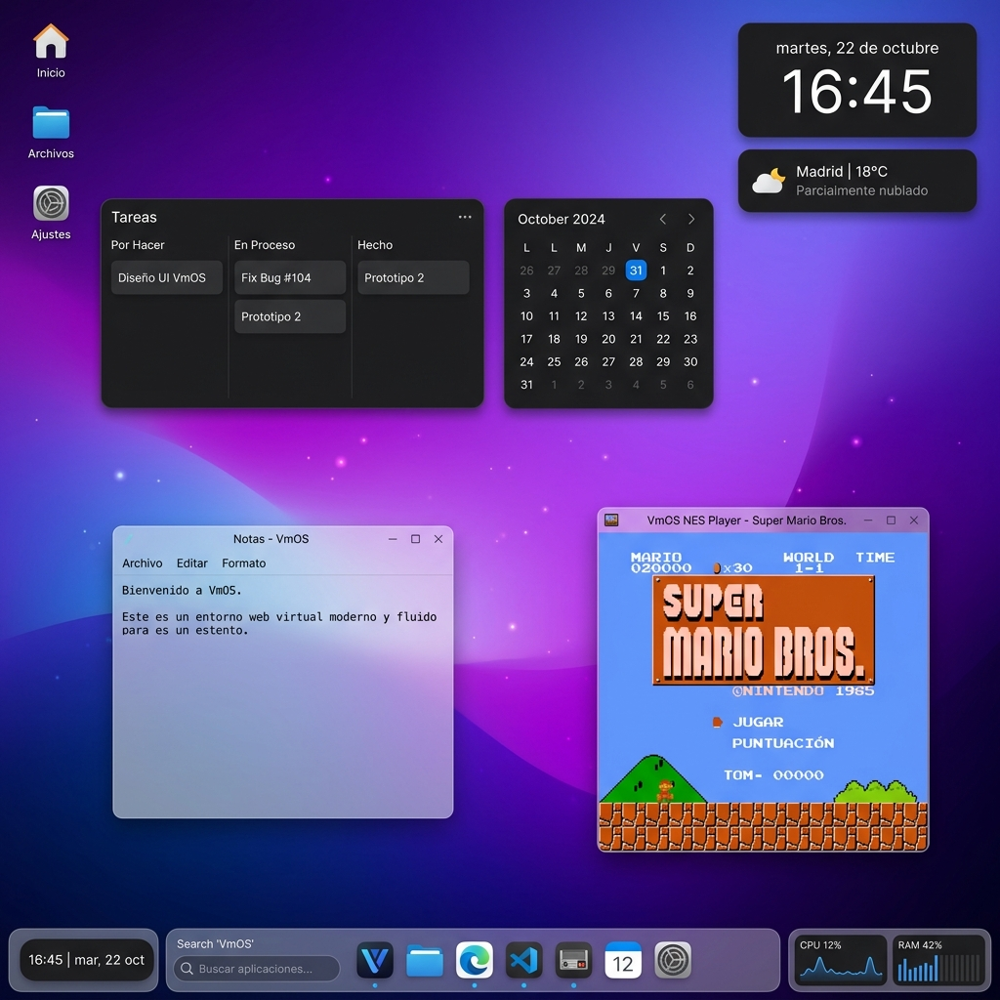
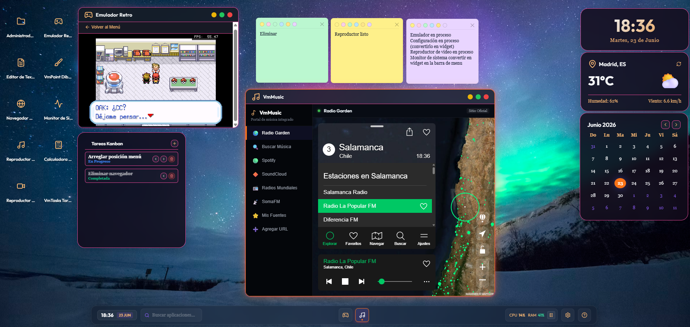
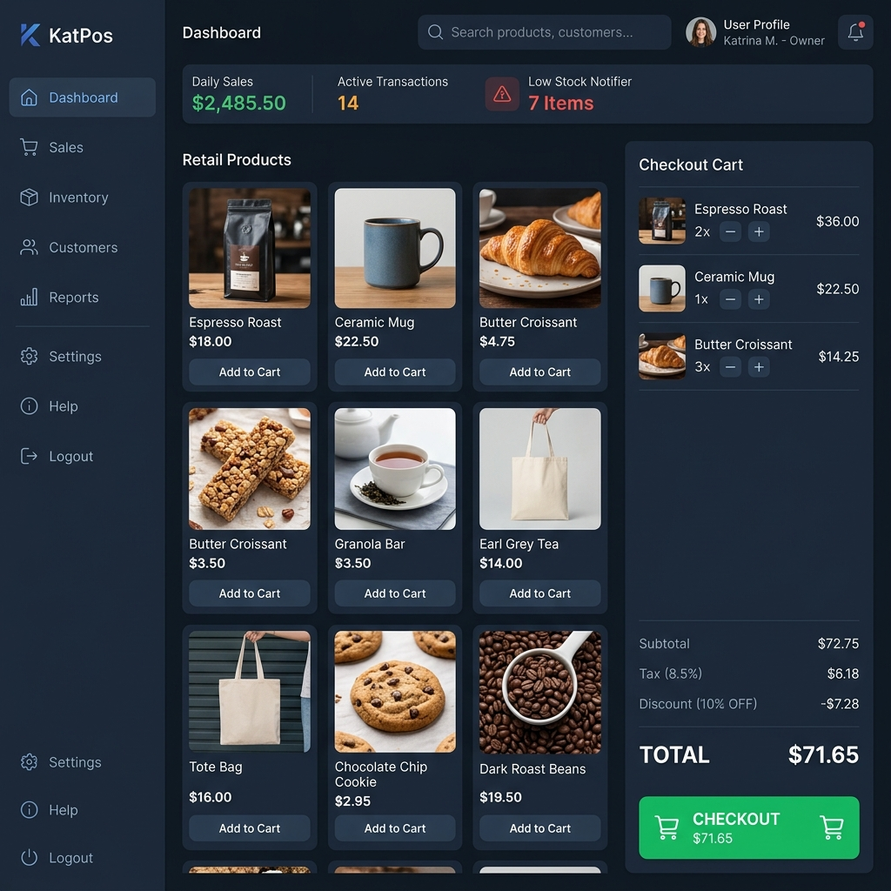
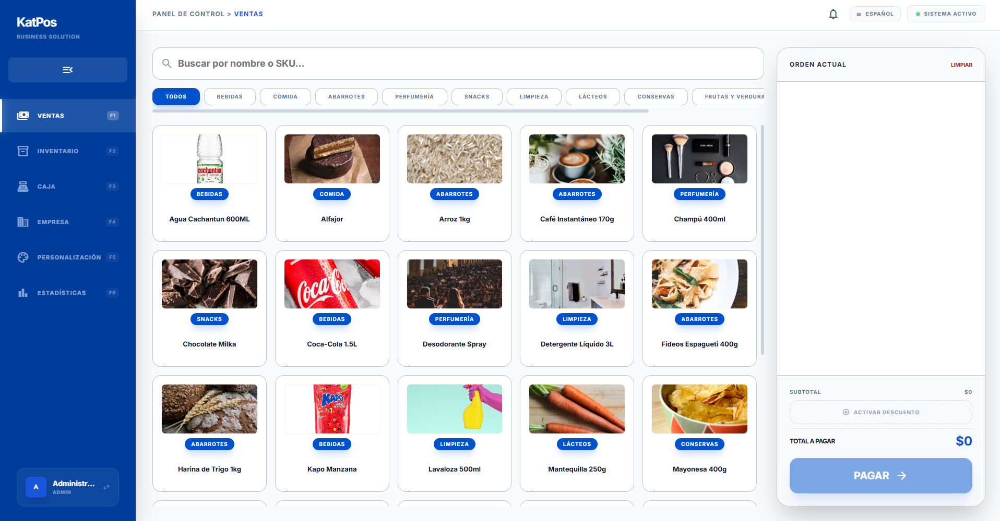
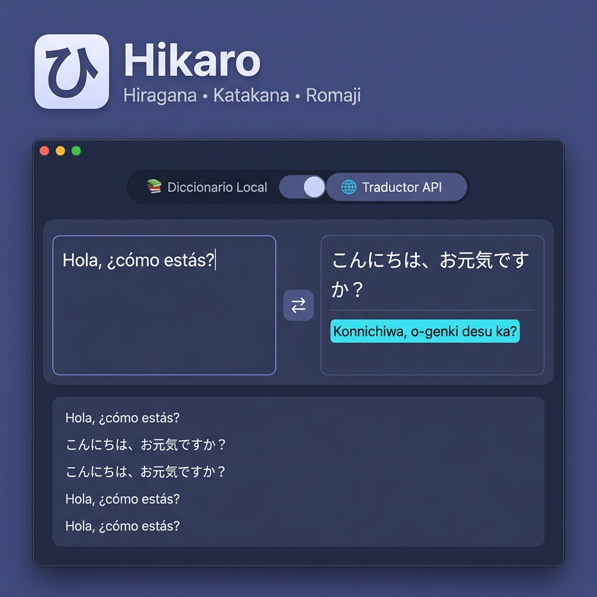
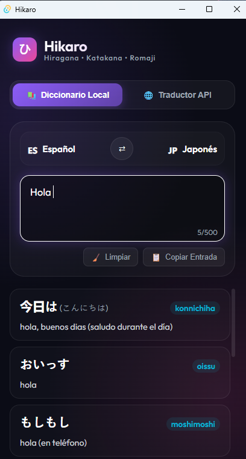
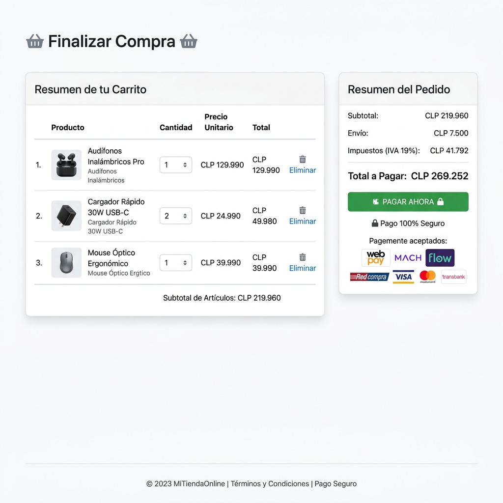

<h1> Hola­­­­, mi nombre es Cristian 👋 </h1>

 ⌑⌑⌑⌑⌑⌑⌑⌑⌑⌑⌑⌑⌑⌑⌑⌑⌑⌑⌑⌑⌑⌑⌑⌑⌑⌑⌑⌑⌑⌑⌑⌑⌑⌑⌑⌑⌑⌑⌑⌑⌑⌑⌑⌑⌑⌑⌑⌑⌑⌑⌑⌑⌑⌑⌑⌑⌑⌑⌑⌑⌑⌑⌑⌑⌑⌑⌑⌑⌑⌑⌑⌑⌑⌑⌑⌑⌑⌑⌑⌑⌑⌑⌑⌑⌑⌑⌑⌑⌑⌑⌑⌑⌑⌑⌑⌑⌑⌑⌑⌑⌑⌑⌑⌑⌑⌑⌑⌑⌑⌑⌑⌑⌑⌑⌑⌑⌑⌑⌑⌑⌑⌑⌑⌑⌑⌑⌑⌑⌑⌑⌑⌑⌑ 

<h1> Sobre mi </h1>

➭ Creación de paginas web, escritorio y móviles.

➭ Soporte en areas de software, hardware y redes.

  

 ⌑⌑⌑⌑⌑⌑⌑⌑⌑⌑⌑⌑⌑⌑⌑⌑⌑⌑⌑⌑⌑⌑⌑⌑⌑⌑⌑⌑⌑⌑⌑⌑⌑⌑⌑⌑⌑⌑⌑⌑⌑⌑⌑⌑⌑⌑⌑⌑⌑⌑⌑⌑⌑⌑⌑⌑⌑ 

## 💻 Tech Stack & Herramientas

### ⚙️ Backend & Bases de Datos

  
  
  
  
  
  

### 🎨 Frontend & Escritorio

  
  
  
  
  
  
  

### 🔗 APIs, Integraciones & Herramientas

  
  
  
  
  

---

## 🚀 Proyectos Destacados

### 🖥️ 1. VmOS - Escritorio Virtual Web Multi-Ventana
Un sofisticado entorno de escritorio virtual interactivo basado en *Glassmorphism* (efecto de cristal esmerilado) que se ejecuta en cualquier navegador web.

### Prototipo

  

### Final

  

* **Contexto del Proyecto**: Diseñado como un entorno sandbox web interactivo para integrar múltiples herramientas de utilidad y entretenimiento (editores, reproductores de media, emuladores) en una sola pestaña del navegador. Resuelve la necesidad de tener un sistema de escritorio virtual modular, escalable y persistente sin sobrecargar el hardware del cliente.
* **Tecnologías Usadas y su Rol**:
  * **Vanilla HTML5 & CSS3 (Grid, Flexbox, Glassmorphism)**: Usados para crear una interfaz dinámica ultra-responsiva que imita un sistema operativo de escritorio real, con desenfoques de ventana (*backdrop-filter*) y animaciones fluidas sin depender de frameworks frontend pesados.
  * **JavaScript Vanilla (ES6 Modules)**: Controla el gestor de ventanas (Window Manager) de alto rendimiento, el arrastre/redimensionamiento de capas, el foco inteligente y la lógica del grid de iconos.
  * **Firebase Realtime DB**: Proporciona sincronización en la nube y persistencia en tiempo real para el sistema de archivos del usuario, permitiendo crear, renombrar y mover carpetas agrupadas (estilo Android) y archivos.
  * **Consola de Emulación Retro**: Integración de intérpretes web de ROMs clásicas (NES, GameBoy, SNES, Genesis) para habilitar gaming interactivo en el navegador.

---

### 🛒 2. KatPos - Sistema de Punto de Venta (POS) de Alto Rendimiento
Una solución de facturación, caja y gestión de inventario robusta y ultra-rápida compilada para escritorio.

### Prototipo

  

### Final

  

* **Contexto del Proyecto**: Desarrollado para pequeños y medianos comercios locales que requieren un punto de venta (POS) y control de stock extremadamente rápido. Al ejecutarse de forma local y offline en el escritorio, evita las caídas de internet y la latencia de los servidores en la nube típicos de los sistemas web convencionales.
* **Tecnologías Usadas y su Rol**:
  * **Tauri v2 (Rust Core Backend)**: Actúa como el motor del sistema de escritorio de alta eficiencia, compilando la aplicación en un ejecutable ultra-liviano (menos de 10MB) con un consumo insignificante de memoria RAM y acceso nativo al hardware.
  * **React 19 & TypeScript**: Estructura de forma segura el catálogo dinámico, el buscador y el carrito de compras de alta velocidad, garantizando la consistencia de los datos en toda la interfaz de usuario.
  * **TailwindCSS**: Utilizado para maquetar de forma ágil un sistema de temas oscuro/claro y componentes interactivos responsivos.
  * **Recharts**: Renderiza gráficas de barra y de línea interactivas del histórico de ventas y ganancias del negocio de forma nativa.
  * **Atajos de Teclado de Navegación**: Asigna las teclas globales `F1-F6` para alternar vistas sin requerir el mouse, optimizando la productividad de los cajeros en ambientes de alta afluencia.

---

### 🇯🇵 3. Hikaro - Traductor e Historial de Japonés Local & API
Una aplicación de escritorio híbrida para traducción y aprendizaje del idioma japonés.

### Prototipo

  

### Final

  

* **Contexto del Proyecto**: Una herramienta interactiva de escritorio desarrollada para entusiastas, estudiantes y traductores de idioma japonés. Combina búsquedas binarias en un diccionario local español-japonés de más de 170k definiciones con traducciones dinámicas en línea mediante una API externa para frases complejas.
* **Tecnologías Usadas y su Rol**:
  * **Tauri (Rust)**: Proporciona la envoltura nativa de escritorio híbrida, asegurando una carga instantánea y una comunicación segura con el sistema.
  * **Búsqueda Indexada (JavaScript ES6)**: Realiza consultas en milisegundos en el diccionario de datos estructurado en JSON local (`dict-es-ja.json`), permitiendo su uso completo sin conexión a internet.
  * **APIs de Traducción & Conversor Romaji**: Conexión asíncrona a traductores en línea y desglose automático de la pronunciación fonética en Romaji para simplificar la lectura de caracteres kanji/kana.
  * **Vanilla CSS (Diseño Oscuro)**: Estiliza una interfaz limpia orientada al contraste visual para sesiones prolongadas de lectura y estudio.

---

### 💳 4. E-commerce Flow - Pasarela de Pago Integrada
Un sistema completo de tienda virtual integrado con la pasarela de pagos chilena **Flow** (Webpay, Mach, Servipag, etc.).

  

* **Contexto del Proyecto**: Prototipo transaccional desarrollado para resolver la complejidad técnica de conectar una tienda virtual con el proveedor de pagos chileno Flow (Webpay/Mach), asegurando que las transacciones sean válidas, que no haya manipulación de precios en el cliente y que las boletas se emitan automáticamente de forma asíncrona tras la confirmación de pago.
* **Tecnologías Usadas y su Rol**:
  * **PHP 8.2 & CodeIgniter 4 (MVC)**: Proporcionan la arquitectura del servidor para gestionar de forma segura las sesiones persistentes del carrito, el catálogo de productos y los endpoints transaccionales.
  * **Algoritmo de Firma HMAC SHA256**: Genera la firma digital obligatoria de parámetros ordenados alfabéticamente para autenticar las peticiones ante la API de Flow, previniendo fraudes y alteraciones en el proceso.
  * **Webhooks & cURL (Flow API)**: Gestiona la recepción de notificaciones asíncronas de Flow en el callback `/flow/confirm` para procesar el pago y emitir la boleta fiscal en la base de datos de manera invisible para el cliente.
  * **MySQL / MariaDB**: Almacena las órdenes transaccionales, el desglose de productos comprados (`order_items`) y las boletas emitidas (`receipts`) con integridad referencial.
  * **ngrok**: Abre un túnel seguro a internet para permitir que los servidores de Flow se comuniquen con el webhook local de desarrollo.

---

## 📈 Estadísticas de GitHub

  <table border="0">
    <tr>
      <td align="center" width="50%">
        
      </td>
      <td align="center" width="50%">
        
      </td>
    </tr>
  </table>

---

  <h3>📫 ¡Conectemos!</h3>
  
Si te interesa colaborar en algún desarrollo, tienes dudas sobre mis proyectos o buscas un desarrollador de software a medida, ¡contáctame!

  
  

    
    
    
  

